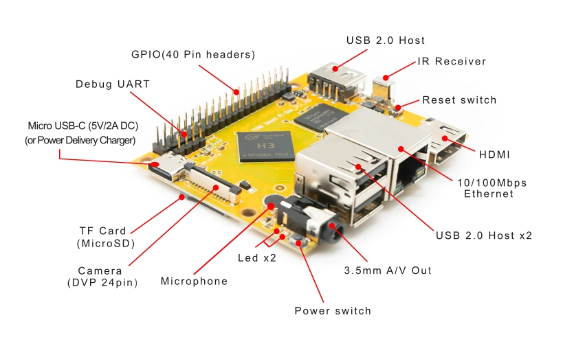
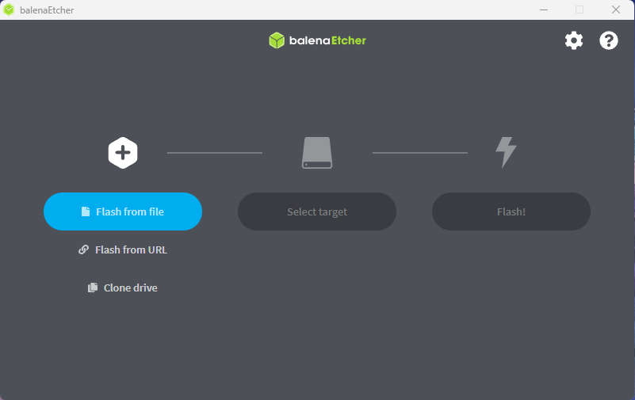
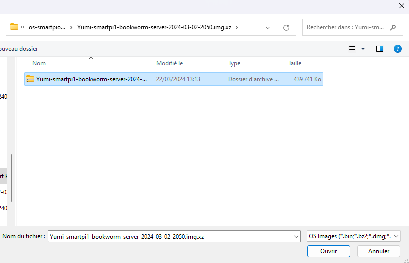
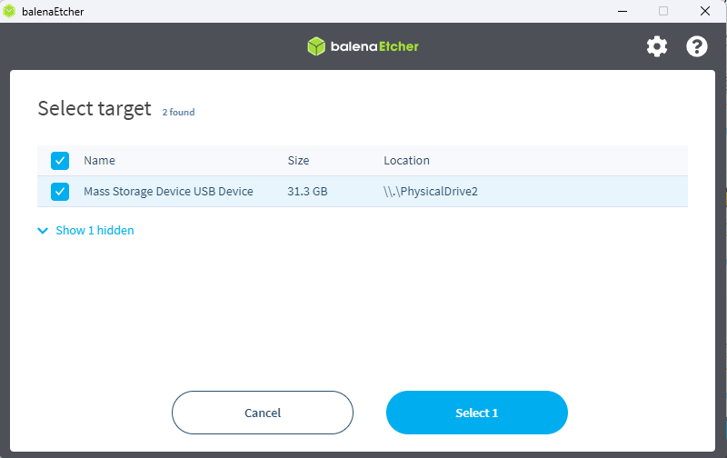
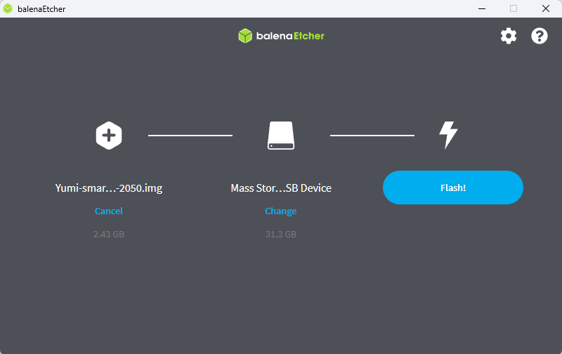

# 1.3 Linux flash Micro SD CARD

In this guide, I'll walk you through the steps to install operating system (server or desktop) on your Smart Pi One.


## 1.3.1 Hardware

- Smart Pi One
- Micro SD Card (Minimum of 16GB)
- USB keyboard and mouse
- Computer display (HDMI)
- Micro-USB power supply (5V - 2A  or Power delivery )

## 1.3.2 Download
Go to Official images. Choose the Armbian version you'd like to install (Debian 12 or UBuntu)


- <B>DEBIAN SERVER :</B> [Yumi-smartpi1-bookworm-server-2024-03-02-2050](https://www.dropbox.com/scl/fo/aalul2sy5xriflqh0v038/h/SMART%20PI%20ONE/DEBIAN%2012/Yumi-smartpi1-bookworm-server-2024-03-02-2050.img.xz.zip?rlkey=x6zccvwdrtmwndpmnx9447bpg&dl=0)
- <B>DEBIAN 12 Desktop :</B> [Yumi-smartpi1-bookworm-desktop-2024-03-02-2050](https://www.dropbox.com/scl/fo/aalul2sy5xriflqh0v038/h/SMART%20PI%20ONE/DEBIAN%2012/Yumi-smartpi1-bookworm-desktop-2024-03-02-2050.img.xz.zip?rlkey=x6zccvwdrtmwndpmnx9447bpg&dl=0)
<br>
- <B>UBUNTU SERVER :</B> [Yumi-smartpi1-jammy-server-2024-03-02-2050](https://www.dropbox.com/scl/fo/aalul2sy5xriflqh0v038/h/SMART%20PI%20ONE/UBUNTU/Yumi-smartpi1-jammy-server-2024-03-02-2050.img.xz.zip?rlkey=x6zccvwdrtmwndpmnx9447bpg&dl=0)


## 1.3.3 Use Etcher to write the Smart Pi One SD Card Image to your microSD card

Download, install, and launch Etcher.

- Open Etcher and click <B>"Select image"</B>.



- Choose the operating system image you downloaded.



- Click <B>"Select target"</B>.


- Choose the micro sd and click <B>"Select 1"</B>.



- Click “Flash!” and wait for the process to complete.



- It will take Etcher about 10 minutes to write and validate the image if your microSD card.


## 1.3.4 Booting from MicroSD (First Boot)

Insert the microSD card into your Smart Pi One.

Connect your Smart Pi One to a display, keyboard, and mouse (if necessary).

Power on your Smart Pi One.

## 1.3.5 Initial Setup

Operating system  will guide you through the initial setup. Follow the on-screen instructions, including setting a root password and creating a user.

## 1.3.6 Software Updates

After booting, open a terminal. Run the following commands to update your system:

```
sudo apt update && sudo apt upgrade
```

Debian 12 or Ubuntu will download and install the latest updates and patches.

## 1.3.7 Additional Software

Install additional software or packages you need by running:

```
psudo apt install [package-name]
```

Let's go! Operating  system is now up and running on your Smart Pi One. You can explore a variety of applications, use it as a server, or engage in some exciting DIY projects.


