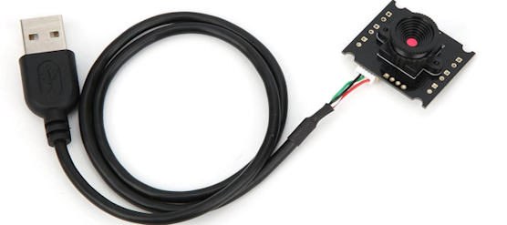

# Testing USB Camera on Smart Pi One



This page provides instructions for testing a USB camera connected to Smart Pi One on an Armbian Debian system. The camera is typically connected to the `/dev/video0` source by default, but this may vary depending on your system configuration. Make sure to check the correct video source (e.g., `/dev/video1`) and adjust the commands accordingly.

---

## 1. **Linux Commands for Camera Testing**

Before running the test programs, ensure that your camera is recognized and accessible by following these steps:

- Verify the connected camera device using `v4l2-ctl`:

  ```bash
  sudo apt-get update
  sudo apt-get install v4l-utils
  v4l2-ctl --list-devices
  ```

  This will display a list of video devices connected to the system (e.g., `/dev/video0`, `/dev/video1`). Identify the correct device and adapt the commands as necessary.

- To test recording video using `ffmpeg`, install `ffmpeg` first:

  ```bash
  sudo apt-get install ffmpeg
  ```

  Then, run the following command, replacing `/dev/video0` with your detected video source if needed (e.g., `/dev/video1`):

  ```bash
  ffmpeg -f v4l2 -i /dev/video0 -c:v libx264 -preset ultrafast output.mp4
  ```

  This command captures video from the specified camera and saves it to `output.mp4`.

---

## 2. **Python Camera Test**

### Install the Required Packages

Before running the Python script, install the necessary OpenCV package:

```bash
sudo apt-get update
sudo apt-get install python3-opencv
```

### Create the Python Test Script

1. Use the `nano` editor to create the Python script:

   ```bash
   nano camera_test.py
   ```

2. Add the following Python code, making sure to adjust the source (`/dev/video0`) if necessary:

   ```python
   import cv2

   # Open the camera (replace /dev/video0 with the correct source if needed)
   cap = cv2.VideoCapture('/dev/video0')

   if not cap.isOpened():
       print("Error: Could not open video device")
       exit()

   # Set camera parameters (optional)
   cap.set(cv2.CAP_PROP_FRAME_WIDTH, 640)
   cap.set(cv2.CAP_PROP_FRAME_HEIGHT, 480)

   # Capture a single frame
   ret, frame = cap.read()

   if not ret:
       print("Error: Could not read frame")
       exit()

   # Save the captured frame to a file
   cv2.imwrite('captured_frame.jpg', frame)

   # Release the camera
   cap.release()
   ```

3. Save and exit by pressing `Ctrl + X`, then `Y`, and `Enter`.

### Run the Python Test Script

Run the script to capture an image from the camera:

```bash
python3 camera_test.py
```

The image will be saved as `captured_frame.jpg` in the current directory. Remember to adjust the video source (`/dev/video0`, `/dev/video1`, etc.) based on the device detected earlier.

---

## 3. **C Camera Test**

### Install the Required Packages

For the C test, you will need OpenCV development libraries:

```bash
sudo apt-get update
sudo apt install libopencv-dev
```

### Create the C Test Program

1. Use `nano` to create the C program:

   ```bash
   nano camera_test.c
   ```

2. Add the following C code, adjusting the source (`/dev/video0`) if necessary:

   ```c
   #include <opencv2/opencv.hpp>
   #include <iostream>

   using namespace cv;
   using namespace std;

   int main() {
       // Open the camera (replace /dev/video0 with the correct source if needed)
       VideoCapture cap("/dev/video0");

       if (!cap.isOpened()) {
           cout << "Error: Could not open video device" << endl;
           return -1;
       }

       // Set camera parameters (optional)
       cap.set(CAP_PROP_FRAME_WIDTH, 640);
       cap.set(CAP_PROP_FRAME_HEIGHT, 480);

       Mat frame;
       // Capture a single frame
       bool ret = cap.read(frame);

       if (!ret) {
           cout << "Error: Could not read frame" << endl;
           return -1;
       }

       // Save the captured frame to a file
       imwrite("captured_frame.jpg", frame);

       // Release the camera
       cap.release();

       return 0;
   }
   ```

3. Save and exit by pressing `Ctrl + X`, then `Y`, and `Enter`.

### Compile the C Program

Compile the program using the following command:

```bash
g++ camera_test.c -o camera_test `pkg-config --cflags --libs opencv4`
```

### Run the C Program

Run the program to capture an image from the camera:

```bash
./camera_test
```

The image will be saved as `captured_frame.jpg` in the current directory. Make sure to adjust the video source (`/dev/video0`, `/dev/video1`, etc.) based on your setup.


